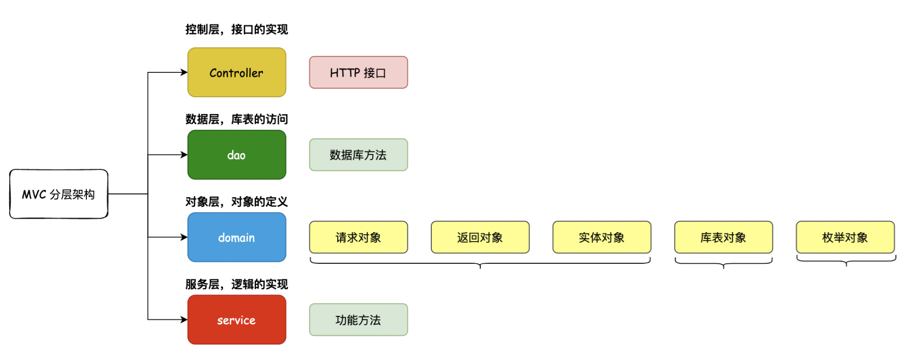
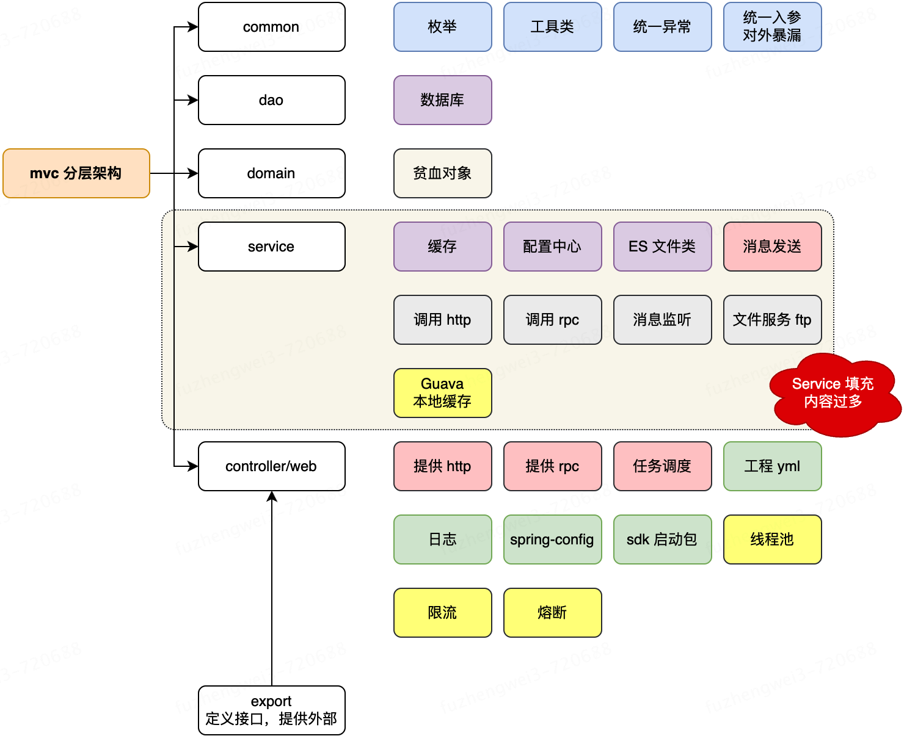
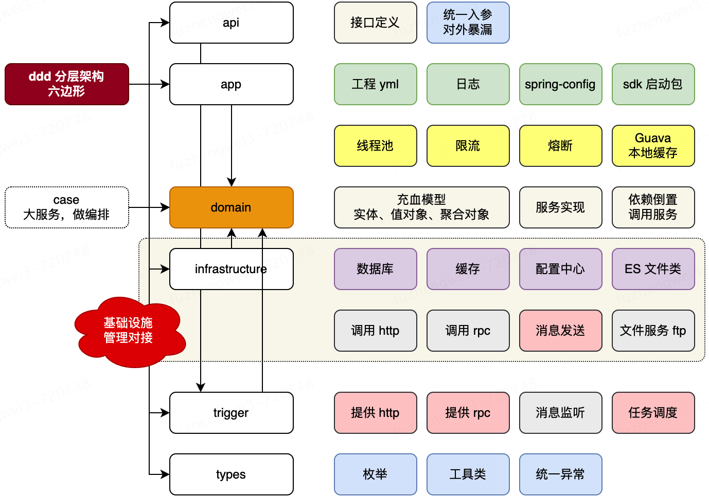
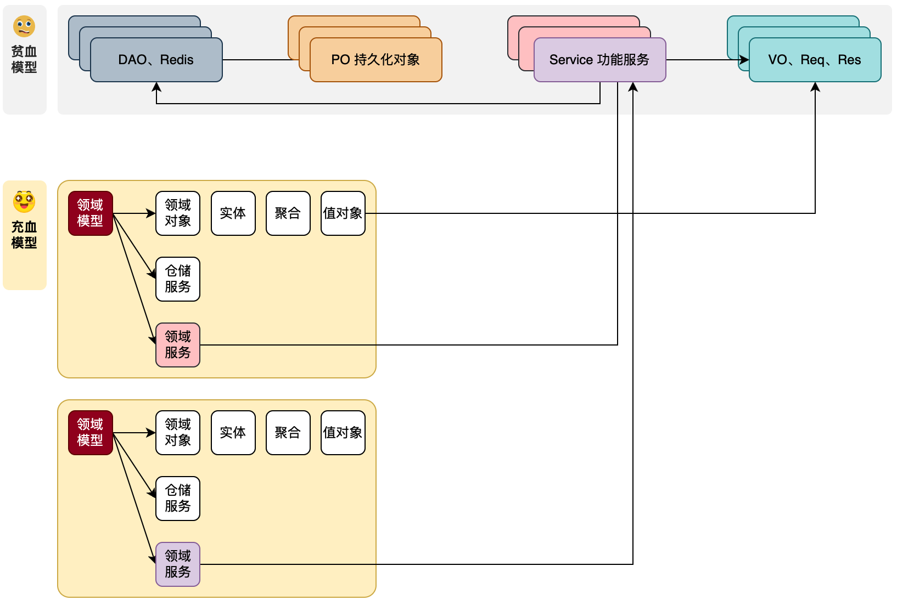

# MVC 与 DDD

## MVC

Mvc 架构通常包含以下四层，可以发现 service 层是实现功能的核心。当随着开发的工程逐渐变大，一个 service 中可能会注入许多其他的 service 用来实现自己需要的功能，这样 service 就会越来越庞大。即行为对象的不断交叉使用，是让系统不断增加复杂度，并到难以维护的根因。

## DDD

DDD 实际上是一种软件设计方法，基于这种设计思想，衍生出来了 DDD 架构。

### 分层

api层：对外暴露接口

app层：启动层，做一些全局配置等等，其存在就是为了启动服务

domain层：用于领域划分，服务实现

case层：用于领域编排，即串联领域服务，对于不太复杂的服务不需要这一层

infrastructure(基础设施) 层：用于实现仓储服务，包括与数据库、redis 、mq发送等交互

trigger(触发)层：提供 http 服务、rpc 服务、消息监听、任务调度等。即触发发起对领域编排的调用。

types层：也可以叫common层，提供全局会使用的工具类、异常等。

关键概念：

### 充血模型与贫血模型

充血模型：狭义上指将对象的属性信息和行为逻辑聚合在一个类中。广义上还可以是在整个包结构中，一个包下包括了用于实现此包 Service 服务所需的各类零部件（模型、仓储、工厂）

贫血模型：状态、行为分离到不同的类/包中，MVC 架构下的 domain 层就是这样

### 领域模型

DDD 架构中最核心的 domain 层由众多领域模型构成。

**特点1** ：与 MVC 最大的区别在于把原有的`众多 Service + 数据模型`的方式，拆分为独立的有边界的领域模块。每个领域内创建自身所属的；领域对象（实体、聚合、值对象）、仓储服务(DAO 操作)、领域服务等。举例；一套账户服务中的，授信认证、开户、提额降额等，每一个都是一个独立的领域，在每个独立的领域内，创建自身领域所需的各项信息。

**特点2**：自身只关注业务功能实现，不与外部任何接口和服务直连。如；不会直接调用 DAO 操作库，也不会调用缓存操作 Redis，更不会直接引入 RPC 连接其他微服务。而是通过定义调用外部数据的含有出入参对象的接口标准，让基础设施层做具体的调用实现。

#### 领域对象

##### 实体对象

实体 = 唯一标识 + 状态属性 + 行为动作（功能）

代表了具有唯一标识的领域对象。持久化PO对象是原子类对象，不具有业务语义，而实体对象是具有业务语义且有唯一标识的对象，跟随于领域服务方法的全生命周期对象。如；用户PO持久化对象，会涵盖，用户的开户实体、授信实体、额度实体对象。

**PO持久化对象 >= 实体对象**

##### 值对象

没有唯一标识，通常是配合实体对象使用，如为实体对象提供对象属性值的描述，通常是枚举值。比如：员工的职级、商品的分类等

##### 聚合对象

当对数据库的操作需要使用到多个实体时，可以创建聚合对象。一个聚合对象，代表着一个数据库事务，具有事务一致性。

#### 仓储服务

使用了依赖倒置的思想。是一组接口，负责封装所有与数据源交互的操作。具体由基础设施层实现。