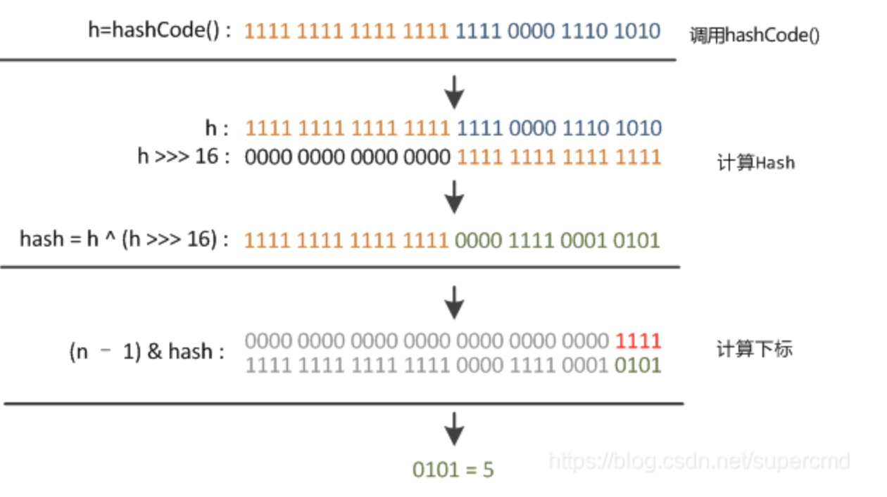

## HashMap和ThreadLocal的散列算法
### `ThreadLocal`

```java
@Test
public void test_idx() {
    int hashCode = 0;
    for (int i = 0; i < 16; i++) {
        hashCode = i * 0x61c88647 + 0x61c88647;
        int idx = hashCode & 15;
        System.out.println("斐波那契散列：" + idx + " 普通散列：" + (String.valueOf(i).hashCode() & 15));
    }
} 

斐波那契散列：7 普通散列：0
斐波那契散列：14 普通散列：1
斐波那契散列：5 普通散列：2
斐波那契散列：12 普通散列：3
斐波那契散列：3 普通散列：4
斐波那契散列：10 普通散列：5
斐波那契散列：1 普通散列：6
斐波那契散列：8 普通散列：7
斐波那契散列：15 普通散列：8
斐波那契散列：6 普通散列：9
斐波那契散列：13 普通散列：15
斐波那契散列：4 普通散列：0
斐波那契散列：11 普通散列：1
斐波那契散列：2 普通散列：2
斐波那契散列：9 普通散列：3
斐波那契散列：0 普通散列：4

```

- **数据结构**：散列表的数组结构

- **散列算法**：斐波那契（Fibonacci）散列法

  >斐波那契散列法的算法原理：
  >
  >1. **选择斐波那契数列中的一个数值**作为哈希函数的参数。这个数值通常是一个较大的斐波那契数，因为较大的斐波那契数有更好的随机性和均匀性，可以提高哈希函数的性能。
  >2. **对键进行哈希计算**。使用选定的斐波那契数值对键进行哈希计算，通常是通过取余操作来将哈希值限制在一个特定范围内，以适应哈希表的大小。

- **寻址方式**：Fibonacci 散列法可以让数据更加分散，在发生数据碰撞时进行开放寻址，从碰撞节点向后寻找位置进行存放元素。

- 理论公式：`f(k) = ((k * 2654435769) >> X) << Y对于常见的32位整数而言，也就是 f(k) = (k * 2654435769) >> 28`，黄金分割点：`(√5 - 1) / 2 = 0.6180339887` `1.618:1 == 1:0.618`

- 在Java中的实现：使用0x61c88647 = = 2^32 * 黄金分割比（约为0.618）。

### `HashMap`

```java
public static int disturbHashIdx(String key, int size) {
    return (size - 1) & (key.hashCode() ^ (key.hashCode() >>> 16));
}
```

- **数据结构**：哈希桶数组 + 链表 + 红黑树

- **散列算法**：扰动函数、哈希索引，可以让数据更加散列的分布

  > 扰动函数：
  >
  > 
  >
  > 1. 使用key.hashCode()计算hash值并赋值给变量h；
  >
  > 2. 将h向右移动16位；
  >
  > 3. 将变量h和向右移16位的h做异或运算（二进制位相同为0，不同为1）。此时得到经过扰动函数后的hansh值。
  >
  >    右移16位正好为32bit的一半，自己的高半区和低半区做异或，是为了混合原始哈希吗的高位和低位，来加大低位的随机性。而且混合后的低位掺杂了高位的部分特征，使高位的信息也被保留下来。

- **寻址方式**：通过拉链寻址的方式解决数据碰撞，数据存放时会进行索引地址，遇到碰撞产生数据链表，在一定容量超过8个元素进行扩容或者树化
