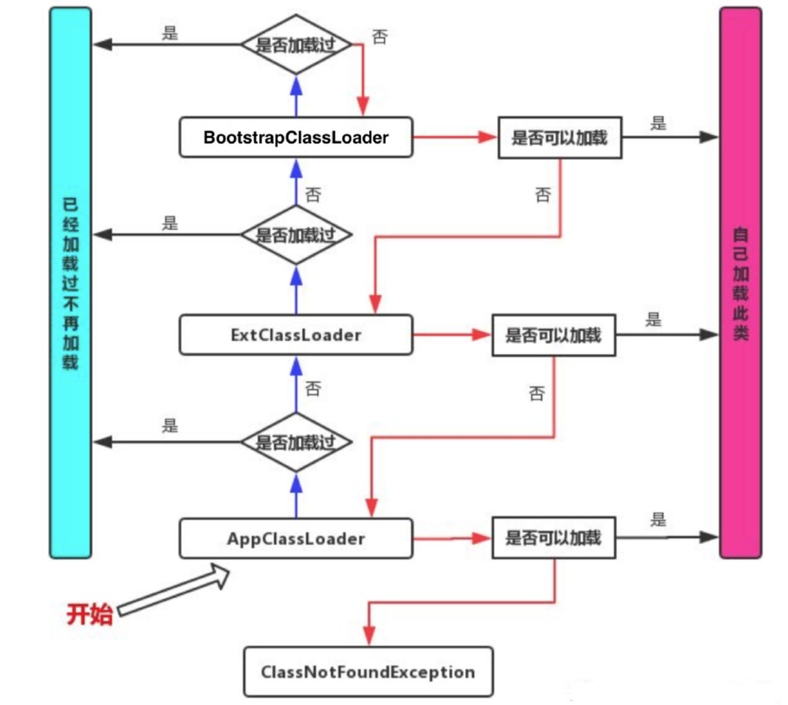
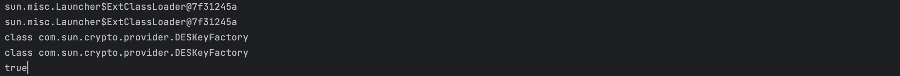
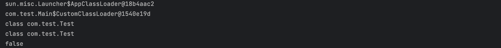

# 双亲委派机制
## 定义

总结来说，就是子类加载器会先看看自己有没有加载过，加载过就不加载了，没加载过就会让父类加载器加载，这样一层一层往上抛，直到父类找不到的时候再让子类去加载。这样的层次结构保证了类加载的一致性和安全性，避免了类的重复加载和恶意代码的替换。



## 验证

### 实验一

```java
public class Main {
    public static void main(String[] args) throws ReflectiveOperationException {
        Class<?> testClass1 = Main.class.getClassLoader().loadClass("com.sun.crypto.provider.DESKeyFactory");
				// com.sun.crypto.provider.DESKeyFactory属于扩展类加载器范围的
        CustomClassLoader customClassLoader = new CustomClassLoader();
        Class<?> testClass2 = customClassLoader.loadClass("com.sun.crypto.provider.DESKeyFactory");

        //看看两个类的类加载器是不是同一个
        System.out.println(testClass1.getClassLoader());
        System.out.println(testClass2.getClassLoader());

        //看看两个类是不是长得一模一样
        System.out.println(testClass1);
        System.out.println(testClass2);

        //两个类是同一个吗？
        System.out.println(testClass1 == testClass2);
      
    }

  // 自定义的类加载器，默认继承应用类加载器
    static class CustomClassLoader extends ClassLoader {
        @Override
        public Class<?> loadClass(String name) throws ClassNotFoundException {
            try (FileInputStream stream = new FileInputStream("./target/classes/"+name.replace(".", "/")+".class")){
                byte[] data = new byte[stream.available()];
                stream.read(data);
                if(data.length == 0) return super.loadClass(name);
                return defineClass(name, data, 0, data.length);
            } catch (IOException e) {
                return super.loadClass(name);
            }
        }
    }
}
```

运行结果：



这证明了当前类加载器会委托上一级类加载器去加载，并且如果是同一个类加载器加载的同一个类，是完全一样的。

### 实验二

```java
package com.test;

public class Test {
}


public class Main {
    public static void main(String[] args) throws ReflectiveOperationException {
        Class<?> testClass1 = Main.class.getClassLoader().loadClass("com.test.Test");

        CustomClassLoader customClassLoader = new CustomClassLoader();
        Class<?> testClass2 = customClassLoader.loadClass("com.test.Test");

        //看看两个类的类加载器是不是同一个
        System.out.println(testClass1.getClassLoader());
        System.out.println(testClass2.getClassLoader());

        //看看两个类是不是长得一模一样
        System.out.println(testClass1);
        System.out.println(testClass2);

        //两个类是同一个吗？
        System.out.println(testClass1 == testClass2);
    }

    static class CustomClassLoader extends ClassLoader {
        @Override
        public Class<?> loadClass(String name) throws ClassNotFoundException {
            try (FileInputStream stream = new FileInputStream("./target/classes/"+name.replace(".", "/")+".class")){
                byte[] data = new byte[stream.available()];
                stream.read(data);
                if(data.length == 0) return super.loadClass(name);
                return defineClass(name, data, 0, data.length);
            } catch (IOException e) {
                return super.loadClass(name);
            }
        }
    }
}
```

运行结果：



这证明了即使是字节码相同的类，当类加载不同时，也是不相同的类。即两个类来自同一个Class文件并且是由同一个类加载器加载的，才能判断为是同一个。

注：

```java
System.out.println(String.class.getClassLoader());
//运行结果为null
// 因为String类位于rt.jar(java运行核心类库)下面,由引导类加载器负责加载，引导类加载器是C++实现的，在Java中获取不到，故该部分为Null
```

## 打破

双亲委派机制存在的问题

- 不灵活：有的时候只想去使用自定义类加载器来加载自己的类，不想去加载父类的。
- 无法实现类的动态更新：比如热部署功能，在双亲委派机制中被加载过的类是不会重复再加载的。所以如果希望重复加载，就要打破双亲委派机制。

双亲委派机制不强制要求实现，只是推荐使用。可以在继承ClassLoader的时候通过重写*findClass*方法实现不加载父类加载器。
