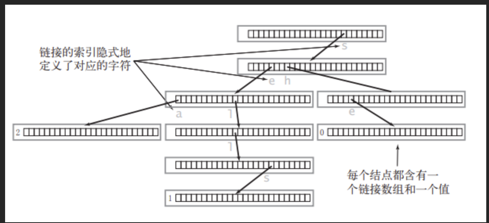

# 基础

## 力扣基础题型
1.数据结构：<br>
<s>数组Array 485/283/27</s><br>
<s>链表Linked List 203/206</s><br>
<s>队列Queue 933/225（用队列实现栈）/622/641</s><br>
<s>栈stack 20/496/232（用栈实现队列）</s><br>
<s>哈希表Hash table 217/389/496</s><br>
<s>集合set 705/217/（设计）</s><br>
<s>堆Heap 215/692</s><br>
树&图<br>
2.算法：<br>
<s>双指针two pointers 141/344/881</s><br>
<s>二分查找 binary search 704/35/162/74</s><br>
<s>滑动窗口 sliding window（技巧） 209/1456</s><br>
<s>递归 recursion 509/206/344/687</s><br>
<s>分治 divide&conquer 169/53/215</s><br>
<s>回溯 backtracking 22/78(有点意思)/77/46（全经典</s><br>
<s>深度优先搜索DFS 938/78/200/687</s><br>
<s>宽度优先搜索BFS 102 107 200</s><br>
<s>并查集 union find 547/721/200</s><br>
<s>贪心 greedy 322/1217/55</s><br>
<s>记忆化搜索（技巧）509/322</s><br>
<s>动态规划 dynamic programming 509/62/121/70/279/221/322</s><br>
<s>拓扑排序 topologic sort 207/210</s><br>
<s>前缀树 trie 208/720/</s>692/53<br>

## 性能

### 读取输入

- String类型的`next()、nextLine()`

  （1）这两个方法都是属于String类型的方法，都可以用来获取在控制台输入的字符串。

  （2）next()方法获取的是连续字符串,遇到空格、换行、回车符停止。

  （3）nextLine()方法获取的是在回车符之前，所输入的一整行字符串，遇到回车符停止，空格、换行符没有影响。


⚠️ 当next()和nextLine()连用时，由于next遇到回车符就停止了，回车符还留在缓冲区中，后面接着nextLine，nextline会直接读取到回车符，就会停止了，这时无法继续输入。

```java
// 解决方法：多用一个nextline读取多余的回车
 public static void main(String[] args) {
        Scanner scanner = new Scanner(System.in);

        // 先调用next再调用nextLine，分别各输出一句
        String str1 = scanner.next(); // 输入：今晚月色真美
        System.out.println(str1);
        scanner.nextLine(); // 释放掉缓冲区的回车符
        String str2 = scanner.nextLine(); // 输入：风也温柔
        System.out.println(str2);
    }
```

- Boolean类型的`hasNext()`与`hasNextLine()` :

   1. hasNext()方法以检测接下来是否还有非空字符为主，如果有则返回true，否则false
   2. hasNextLine()方法，从名字可以推测，是以行的方式去判断的，即判断接下来是否还有一行（\n空行也被当作一行），如果有则返回true，反之返回false

- 循环读入

   ```java
   while (scanner.hasNextLine()) {
   
   }
   ```

   

- 普遍方式

   ```java
   // 读取输入
   Scanner scanner = new Scanner(System.in);
   int n = scanner.nextInt();// 读取整数
   scanner.nextLine(); // 读取整数后的换行符
   scanner.nextLine(); // 读取下一行
   
   // 输出
   // 反复使用
   System.out.println("..."); 
   ```

- 新方法

   ```java
   import java.io.BufferedReader;
   import java.io.InputStreamReader;
   
   // 读取输入
   BufferedReader br = new BufferedReader(new InputStreamReader(System.in));
   br.readLine();
   String str;
   while ((str = br.readLine()) != null){
   // 操作
   }
   // 输出
   StringBuffer sb = new StringBuffer();
   // 将所有结果计入sb中，一次性输出
   sb.append("...").append("\n");
   sb.append("...").append("\n");
   sb.append("...").append("\n");
   
   System.out.println(sb); 
   ```

- 小结：

   1. 测试中使用`Scanner`的速度比`BufferedReader`慢了300ms，通过`StringBuffer`输出比反复调用`System.out`要快300-400ms
   1. `BufferedReader`相对于`Scanner`来说要快一点，因为`Scanner`对输入数据进行正则解析，而`BufferedReader`只是简单地读取字符序列
   1. system.out 和java运行程序运行在同一线程，也就是说，业务程序会等待system.out的动作，导致资源被占用。解决办法:改用[log4j](https://so.csdn.net/so/search?q=log4j&spm=1001.2101.3001.7020) 等工具进行调试信息的打印。这类工具是异步线程的，不会使程序处于等待状态。

### 复杂度

- 没有循环的复杂度是`O(1)`

## 知识点

### 数组

#### 题型

- **有序**数组原地移除：双指针法

  给你一个有序数组 `nums` ，请你**[ 原地](http://baike.baidu.com/item/原地算法)** 删除重复出现的元素，使得出现次数超过两次的元素**只出现k次** ，返回删除后数组的新长度。

  不要使用额外的数组空间，你必须在 **[原地 ](https://baike.baidu.com/item/原地算法)修改输入数组** 并在使用 O(1) 额外空间的条件下完成。

  思路：

  - 由于是保留 k 个相同数字，对于前 k 个数字，我们可以直接保留
  
  - 对于后面的任意数字，能够保留的前提是：与当前写入的位置n前面的第 k 个元素（新数组）进行比较，即n - k,不相同则保留
  
    ```java
        public int removeDuplicates(int[] nums) {
            int n = k;
            for(int i = k; i < nums.length; i ++){
                if(nums[i] != nums[n - k]){
                    nums[n ++] = nums[i]; 
                }
            }
            return n;
        }
    ```
  
    

### 链表

#### 反向链表

- 方法：
  1. 栈法
  2. 双向链表法：让原链表节点变成新链表的头节点。（头插/记录前一节点）
  3. 递归 == 没看懂

#### 合并两个链表

- 方法：新建一个链表
- 技巧：单链表通常在头部放一个哑节点，作为头节点

### 栈

#### 实现

- 可以直接用`Stack`，`Arraylist`,`LinkedList`实现

#### 题型

##### 模拟队列

- 思路一：双栈：一个主栈，一个辅助栈

- 使用辅助栈对`push`下手，即在`push`的时候就把栈中元素的顺序颠倒过来，其他操作和栈一样

  ```java
   public void push(int x) {
          Stack<Integer> s2 = new Stack<>();
          while(!s1.isEmpty()){
              s2.push(s1.pop());
          }
          s1.push(x);
          while(!s2.isEmpty()){
              s1.push(s2.pop());
          }
      }
  ```

  缺点是只要`push`都要颠倒，时间复杂度和队列长度成正比
  
- 思路二：双栈：一个`in`栈用于`push`，一个`out`栈用于`pop,peek`

  即只有要`pop`的时候才调整顺序，并且是在`out`栈空了的时候，才需要到`in`栈里补充

  ```java
      public void push(int x) {
          in.push(x);
      }
      
      public int pop() {
          if(out.isEmpty()){
              reverse();
          }
          return out.pop();
      }
  
      protected void reverse(){
          while( !in.isEmpty()){
              out.push(in.pop());
          }
      }
  ```

  

##### 括号匹配

##### 逆波兰表达式

##### 下一个更大元素

- 暴力求解法的时间复杂度是`O(n平方)`，优化的思路是直接就能查找到目标元素的下一个更大元素，而不需要再次遍历来寻找

- 预处理 + 记录结果

```java
class Solution {
    public int[] nextGreaterElement(int[] nums1, int[] nums2) {
        Stack<Integer> s = new Stack<>();
        Map<Integer,Integer> map = new HashMap<>();
        // 利用单调栈预处理 num2，并记录结果
        for(int i = nums2.length - 1; i > -1; i --){
            int num = nums2[i];
            while(!s.isEmpty() && num > s.peek()){
                s.pop();
            }
            map.put(num, s.isEmpty()? -1 : s.peek());
            s.push(num);
        }
        int[] re = new int[nums1.length];
        for(int i = 0; i < nums1.length; i ++){
            re[i] = map.get(nums1[i]);
        }
        return re;
    }
}
```


#### 知识点

##### 单调栈 + 哈希表

- 栈中维持单调递增或单调递减

- 通常利用哈希表记录结果（哈希表记录每个元素右边第一个比它大的元素或元素下标）

- 针对求下一个更大元素问题

- 关键不是最后栈中的元素，而是维护单调栈的过程中哈希表中记录的结果

  

  


### 队列

#### 实现

- 普通队列：

  ```java
  Queue<Integer> q = new LinkedList<>();
  ```

- 双端队列：可以在队列的两端进行高效地插入和删除操作

  ```java
  queue = new ArrayDeque<Integer>();
  ```

#### 题型

##### 数据流

##### 模拟栈

- 用两个队列
- 用一个队列

##### 前k个高频/低频单词

优先队列维护k个元素，多余的出队

#### 知识点

##### 循环队列

- 与普通队列相比的优势：不用每次出队后移动所有元素

- front指向队头元素，rear指向队尾元素的下一个。即rear为下一个元素入队的位置

- 问题：队满和队空判断条件一样

  解决：

  - 加一个count计数

  - 留一个空位

    队列初始化：`front = rear = 0`

    队空条件：`front == rear`

    队满条件：`(rear + 1) % maxSize == front` (`maxSize `是包含空位的总空间大小)
    
    队尾元素的位置：`(rear - 1 + maxsize) % maxsize`
    
    队列当前长度：`(rear - front + maxsize) % maxsize`

##### 优先队列

- 一种具有优先级的队列，其中元素按照其优先级进行排序。一个基于优先堆（binary heap）的数据结构。

- 实现了Comparable接口，可以自定义排序方式

  ```java
  // 默认是最小堆
  PriorityQueue<Integer> minHeap = new PriorityQueue<>();
  
  // 使用自定义比较器创建最大堆
  PriorityQueue<Integer> maxHeap = new PriorityQueue<>(Collections.reverseOrder());
  public class CustomObject implements Comparable<CustomObject> {
      // 实现 compareTo 方法
      @Override
      public int compareTo(CustomObject other) {
          // 比较逻辑
          // 返回负数表示 this 小于 other
          // 返回正数表示 this 大于 other
          // 返回零表示相等
      }
  }
  
  // 或者使用自定义比较器
  PriorityQueue<CustomObject> customQueue = new PriorityQueue<>(new CustomComparator());
  
  ```

  

### 哈希表

- 散列表（Hash table，也叫哈希表），是根据关键码值(Key value)而直接进行访问的数据结构。也就是说，它通过把关键码值映射到表中一个位置来访问记录，以加快查找的速度。这个映射函数叫做散列函数，存放记录的数组叫做散列表。数组就是一种哈希表。

  （哈希表的底层是数组）
  实现哈希表的两种方法：
  
  1. 数组+链表
  2. 数组+红黑二叉树

- 哈希函数：建立起数据元素的存放位置与数据元素的关键字之间的对应关系的函数。即**使用哈希函数可将被查找的键转换为数组的索引**。

  哈希函数构造方法 http://t.csdnimg.cn/S6bCu

  1. 直接定址法
     取关键字或关键字的某个线性函数值为哈希地址。即`H(key)=key` 或` H(key)=a*key+b `(a,b为常数)。

  2. 数字分析法
     若关键字是以r为基的数（如：以10为基的十进制数），并且哈希表中可能出现的关键字都是事先知道的，则可取关键字的若干数位组成哈希地址。

  3. 平方取中法

     取关键字平方后的中间几位为哈希地址。

  4. 折叠法

  5. 除留余数法

  6. 随机数法

- 哈希碰撞：不同的元素索引到同一个位置

  解决方法：

  1. 拉链法：拉链法就是要选择适当的哈希表的大小，这样既不会因为数组空值而浪费大量内存，也不会因为链表太长而在查找上浪费太多时间。

     

  2. 线性探测法：要求表的位置比数据多

     例如冲突的位置，放了小李，那么就向下找一个空位放置小王的信息。

- 解决的问题：**用来快速判断一个元素是否出现集合里**

- 常见的哈希结构

  1. 数组
  2. `set `（集合）
  3. `map`(映射)

哈希法也是**牺牲了空间换取了时间**，因为我们要使用额外的数组，set或者是map来存放数据，才能实现快速的查找。

#### 实现

```java
Set<String> hashSet = new HashSet<>();
HashMap<String, Integer> hashMap = new HashMap<>();
```


#### 题型

##### 判断重复元素

##### 设计哈希表

要实现的点：

1. 没有重复
2. 建立元素和索引的关系（设计哈希函数），使得查找，删除，插入都是`O(1)`
3. 解决冲突

思路：简单数组：每一个key值就直接对应下标

##### LRU缓存

[146. LRU 缓存](https://leetcode.cn/problems/lru-cache/)

LRU（Least Recently Used，最近最少使用）缓存是一种常见的缓存策略，它根据缓存中数据的访问顺序来淘汰最近最少使用的数据。当缓存空间不足时，LRU 算法会淘汰最久未被访问的数据。

分析：

- 使用双向链表实现hashmap的entry的排序
- 双向链表用伪头部和伪尾部
- 每次get后将访问的节点移动到双向链表的头部
- 每次put将新节点移动到双向链表的头部

```java
class Node {
    int key;
    int val;
    Node pre;
    Node next;
    public Node(int key, int val){
        this.key = key;
        this.val = val;
    }
    public Node(){}
}
class LRUCache {
    private Map<Integer, Node> cache = new HashMap<>();
    private int capacity;
    private int size;
    // 伪头和伪尾
    private Node head = new Node();
    private Node tail = new Node();
    public LRUCache(int capacity) {
        this.capacity = capacity;
        head.next = tail;
        tail.pre = head;
    }
    
    public int get(int key) {
        Node node = cache.get(key);
        if(node == null){
            return -1;
        }
        moveToHead(node);
        return node.val;
    }
    
    public void put(int key, int value) {
        // 如果存在，覆盖并移动
        // 如果不存在，判断满了，满了踢出去最后一个，添加到头部，没满直接添加到头部
        Node node = cache.get(key);
        if(node == null){
            Node newNode = new Node(key, value);
            cache.put(key, newNode);
            addToHead(newNode);
            size ++;
            if(size > capacity){
                Node taill = removeTail();
                cache.remove(taill.key);
                size --;
            }
        } else {
            node.val = value;
            moveToHead(node);
        }
    }
    private void moveToHead(Node node){
        removeNode(node);
        addToHead(node);
    }
    
    private void addToHead(Node node){
        node.pre = head;
        node.next = head.next;
        head.next.pre = node;
        head.next = node;
    }
    private void removeNode(Node node){
        node.pre.next = node.next;
        node.next.pre = node.pre;
    }
    private Node removeTail(){
        Node res = tail.pre;
        removeNode(res);
        return res;
    }
}
```

### 图论

#### 图

##### 如何存储一张图？

###### 邻接矩阵（适合没有方向的）

二维数组，简单，但稀疏图会浪费空间，并且删除，插入节点不方便

注:有一次存储时遇到问题

```java
// 使用该条件导致结果错误
while((str = br.readline())!=null){}
// m为边数,使用该条件结果正确
while ((m--) != 0){}
```


###### 邻接表(适合有方向的,且稀疏的)

一种顺序存储与链式存储相结合的存储方式，顺序存储部分用来保存图中的顶点信息，链式存储部分用来保存图中边或弧的信息。

- 

- 
	
	```java
	写法1: 高级写法
	static class Edge {
	        int targetNode;
	        int weight;
	
	        public Edge(int targetNode, int weight) {
	            this.targetNode = targetNode;
	            this.weight = weight;
	        }
	    }
	        List<Edge>[] adjList = new ArrayList[n + 1];
	        for (int i = 1; i <= n; i++) {
	            adjList[i] = new ArrayList<>();
	        }
	```
	
	
	

###### 链式前向星

一种邻接表的写法

关键点：

- 数据结构

  ```java
  // 边
  class Edge {
      int next; // 指向相同起始点的下一条边
      int to; // 邻接点
      int w; // 权重
  }
  Edge[] edge = new Edge[9];
  // edge[cnt]表示编号为cnt的边
  
  // 用数组表示
    int[] next = new int[MAX];
    int[] to = new int[MAX];
    int[] w = new int[MAX];
    // 即next[j]表示与编号为j的边的起始点相同的下一条边
    //   to[j]表示编号为j的边的邻接点
    //   w[j]表示编号为j的边的权重
  
    //存放每个起始点的边头指针
    int[] head = new int[MAX]; 
    // 即head[i]表示以i为起点的第一条边的序号
  ```

- 加边操作

  ```java
    addEdge(int from , int to, int w){
        // cnt为边的序号
        edge[cnt].to = to;
        edge[cnt].w = w;
        // 头插法
        edge[cnt].next = head[from];
        head[from] = cnt
    }
  ```

- 遍历某一起始点的所有边

  ```java
  int t = head[i]; // 假设不存在为-1
  while(t != -1){
  	....
      t = edge[t].next
  }
  ```

  

##### 如何判断一个图有没有环

```java
// m为边数，n为点数
if (m > n * (n - 1) / 2 ) {
   System.out.println("有环");
}
```

##### 拓扑排序


这种叫 **有向无环图**，把一个 有向无环图 转成 线性的排序 就叫 **拓扑排序**。

[207. 课程表](https://leetcode.cn/problems/course-schedule/)

- 需要的数据结构

  ```java
  int[] indeg = new int[n]; // 一个入度表，记录每个节点的入度
  List<List<Integer>> edges = new ArrayList<>(); // 邻接表，用于存图，邻接表在初始化好之后不能修改
  Queue<Integer> q = new Linkedlist<>(); // 队列，用于存储入度为0的节点
  ```

- 算法流程：

  ```java
  // 初始化邻接表和入度表
  // 初始化队列，将入度为0的节点添加进去
  while(!q.isEmpty()){
    // 出队
    // 找到目标节点邻接的节点，将其入度减1
    	// 如果邻接节点的入度减为0了，将其入队
    // 计数器 + 1，计数器用于最后判断该图是否有拓扑序列
  }
  // 结束，找到所有拓扑序列
  ```

  

##### 单源最短路径

###### 迪杰斯特拉算法

- 思想

  如果图是不带负权的有向图或者无向图，可以利用贪心策略，从起点s每次扩展一个距离起点s最短的点，并且利用这个点，更新起点到其他点的距离。

- 算法流程

  1. 存图
  2. 维护两个数组`dis[]`和`visited[]`,来记录每个点到起始点的最短距离以及是否有被访问过
  3. 选择`dis[]`中最小的点,可使用
  4. 更新`visited[]`
  5. 判断是否为目标节点,若是则结束,不是则更新`dis[]`
  6. 循环3-5,直到找到目标节点

#### 树

##### 连通图

在图论中，一个**连通图**是一个图，其中从图中的每一个顶点都存在一条路径到达图中的任意其他顶点。换句话说，一个图是连通的，如果不存在孤立的顶点，每对顶点之间都至少存在一条路径。

##### 树

如果一个无向连通图不包含回路(连通图中不存在环),那么就是一个树。

##### 二叉搜索树

- 搜索性质： 对于树中的每个节点，其左子树中的所有节点的值都小于该节点的值，而右子树中的所有节点的值都大于该节点的值。
- 可以用于快速查找、插入和删除操作。在二叉搜索树中，执行这些操作的时间复杂度通常是 `O(log n)`到 `O(n)`，其中 n 是树中节点的数量。

##### 最小生成树

两种算法


###### prim (普里姆算法)

- 思想

  从起始点出发，选择距离顶点集最近的点加入顶点集，循环直到所有点都在顶点集中

- 过程：

  1. 存储图`graph`
  2. 选择点进入顶点集
  3. 更新各点到顶点集的距离
  4. 循环2，3,直到所有顶点在顶点集中
  
- 关键点:

  1. 如何存图: 二维数组

     注: 尝试使用链表存图,遇到问题:

     - 由于图没有方向,假设有一条边为(1,2,80),在节点1记录与节点2的关系同时也需要在节点2记录与节点1的关系

     - 遇到同一条边有两个权值的情况,应该存权值小的,但链表修改起来很麻烦

  2. 维护两个数组: `dis[]`, `visited[]`,`dis[i]`表示点`i`到当前顶点集的最短距离,`visited[i]`表示点`i`是否加入了顶点集
  
  3. 根据`graph`修改`dis`

###### Kruskal（克鲁斯卡尔）算法

- 思想

  从边出发,按权重从小到大,只要不构成环,就可以将边加入树中,循环直到有(n个顶点)n-1条边加入树中
  
- 过程

  1. 将n个点放在n个独立的集合中
  2. 将边按权值大小排序
  3. 顺序枚举每条边,如果边连接的两点在不同集合,就将边加入最小生成树,并合并两点的集合,否则就跳过
  4. 重复3,直到选取n-1条边

- 关键点

  1. 如何将n个点放在n个独立的集合中?

     维护一个数组`parent[]`,`parent[i]`表示节点`i`的下一个节点,初始化`parent[i]=i`,表示独自一个集合.

  2. 如何判断两点是否在一个集合?

     通过`find`函数找到某节点的最终节点,若两节点的最终节点相同,则在同一集合.

     ```java
     public int find(int i, int[] parent) {
             while (i != parent[i]) {
                 i = parent[i];
             }
             return i;
         }
     ```
     
  3. 如何将两点集合合并?
  
     让某点的最终节点指向另一点
  
     ```java
     int x = find(cost[i][0], parent);
     int y = find(cost[i][1], parent);
     if (x != y) {
          parent[x] = y;
          total = total + cost[i][2];
          cnt++;// 记录加入树的边数量
      }
     ```
  
### 堆

堆的性质

- 堆中某个节点的值总是不大于或不小于其父节点的值。
- 堆总是一棵完全二叉树。

#### 实现

- 优先队列

#### 题型

##### 返回数组中第k个最大元素

##### 堆排序

#### 知识点

大顶堆：任意一个节点都比左右孩子大

##### 构建最大堆

1. `nums`本身就是一个堆，只不过没有顺序，构建最大堆就是调整每一个元素的位置

   

2. 调整位置的顺序是从右到左，从下到上的每一颗子树，从第一个有孩子的节点开始

```java
public int buildMaxHeap(int[] nums, int k){
	int size = nums.length;
	// 建堆
	// 从右到左，从下到上
    // 完全二叉树的性质得，第一个有孩子的节点的下标为size/2 -1
	int index = size/2 -1; 
 	while(index >= 0){
       correct(nums, index, size);
       index --;
       }    
}
```

##### 调整

1. 如果节点`start`的值小于孩子节点，`start`和左右孩子中值大的那个进行交换
2. 由于交换后可能导致当前堆不符合最大堆的规则，所以要一直调整到当前节点没有孩子（递归）

```java
 private void correct(int[] nums, int start, int size){
        int left = 2 * start + 1;
        int max = left;
        if(left < size){
            // 有孩子
            int right = 2 * start + 2;
            if(right < size){
                max = nums[left] < nums[right]? right : left;
            }
            if(nums[start] < nums[max]){
                swap(start,max,nums);
                correct(nums, max, size); 
            }
        }
    }

    private void swap(int x, int y, int[] nums){
        int temp = nums[x];
        nums[x] = nums[y];
        nums[y] = temp;
    }
```

##### 输出

如最后需要输出从大到小排序后的数组

1. 得到最大堆后，根节点应该为最大值
2. 输出根节点
3. 将根节点和最末尾节点进行交换，`size--`
4. 循环直到`size`为1

```java
       while(size - 1 > 0){
           System.out.println(nums[0]);
            swap(0, size - 1,nums);
            size --;
            correct(nums, 0, size);
        }
```


### 位运算

#### 题型

##### 找唯一一个出现奇数次的字符

所有字符异或

#### 知识点

- 异或：不同数相异或为一个新数，相同数异或为0，0与任何数异或为0

  ```java
  char a = 'a'
  char b = 'b'
  int re = a ^ b;
  ```


### ASCII码表

- ASCII码是`int`类型。

- 只有`char`字符才有ASCII码。

  ```java
   int asciiValue = (int)str.charAt(0);
  ```

- 运算符从25-47，其中42-45为加减乘除。

- 数字0~9对应的ASCII码（十进制）为“48”~“57”

  大写字母A~Z对应的ASCII码（十进制）为“65”~“90”

  小写字母a~z对应的百ASCII码（十进制）为"97"~“122”

- 小写转化大写：减去32。 

## 算法

### 搜索

#### 深度优先搜索

##### 二叉树

```java
    private void dfs(TreeNode node, List<Integer> result) {
        if (node == null) {
            return;
        }
        // 具体操作，可以是访问节点值、收集节点值等
        result.add(node.val);

        // 递归遍历左子树
        dfs(node.left, result);
        // 递归遍历右子树
        dfs(node.right, result);
    }
```

##### 网格（岛屿）

看作四叉树

```java
void dfs(int[][] grid, int r, int c) {
    // 判断 base case
    if (!inArea(grid, r, c)) {
        return;
    }
    // 如果这个格子不是岛屿，直接返回
    if (grid[r][c] != 1) {
        return;
    }
    grid[r][c] = 2; // 将格子标记为「已遍历过」
    
    // 访问上、下、左、右四个相邻结点
    dfs(grid, r - 1, c);
    dfs(grid, r + 1, c);
    dfs(grid, r, c - 1);
    dfs(grid, r, c + 1);
}

// 判断坐标 (r, c) 是否在网格中
boolean inArea(int[][] grid, int r, int c) {
    return 0 <= r && r < grid.length 
        	&& 0 <= c && c < grid[0].length;
}
```

##### 题型

###### 二叉树最长同值路径

- 分析：

  区分`max`和`current`: `current`是要返回给上层调用的值。如第三层的4，他作为根节点时的`max`为2,`current`为1

  同值最长路径有三种情况：`\`、`/、∧`

  ```
         4
        / \
       4   4
      / \   \
     4   4   5
    / \
   4   4
  ```

  这种情况下最长路径为4。

- 思路：

  我们将二叉树看成一个有向图（从父结点指向子结点的边），定义同值有向路径为从某一结点出发，到达它的某一后代节点的路径，且经过的结点的值相同。最长同值路径长度必定为某一节点的左最长同值有向路径长度与右最长同值有向路径长度之和。

  ```java
  class Solution {
      int max = 0;
      public int longestUnivaluePath(TreeNode root) {
          dfs(root);
          return max;
      }
  
      private int dfs(TreeNode root){
          int curLeft = 0;
          int curRight = 0;
          if(root == null){
              return 0;
          }
          int maxLeft = dfs(root.left); // 左子树的最长同值路径
          int maxRight = dfs(root.right); // 右子树的最长同值路径 
          if(root.left != null && root.val == root.left.val){
              curLeft = maxLeft + 1;
          }
  
          if(root.right != null && root.val == root.right.val){
              curRight = maxRight + 1;
          }
          max = Math.max(max, curRight + curLeft);
          return Math.max(curRight, curLeft);
      }
  }
  ```


###### 岛屿数量

- 思路：通过深度优先搜索，将所有遍历过的岛屿做标记，需要几次深度优先搜索就有几座岛屿

#### 宽度优先搜索

- 「BFS 遍历」、「层序遍历」、「最短路径」实际上是递进的关系。在 BFS 遍历的基础上区分遍历的每一层，就得到了层序遍历。在层序遍历的基础上记录层数，就得到了最短路径。
- **多源 BFS**」。多源 BFS 很方便，只需要把多个源点同时放入初始队列即可。


##### 二叉树层序遍历

```java
public List<List<Integer>> levelOrder(TreeNode root) {
    List<List<Integer>> res = new ArrayList<>();
    Queue<TreeNode> queue = new ArrayDeque<>();
    if (root != null) { // 重要，不然会报错
        queue.add(root);
    }
    while (!queue.isEmpty()) {
        int n = queue.size();
        List<Integer> level = new ArrayList<>();
        
        // 为了让输出的结果有层次
        // 输入：root = [3,9,20,null,null,15,7]
	   // 输出：[[3],[9,20],[15,7]]
        for (int i = 0; i < n; i++) {     						
            TreeNode node = queue.poll();
            level.add(node.val);
            if (node.left != null) {
                queue.add(node.left);
            }
            if (node.right != null) {
                queue.add(node.right);
            }
        }
        res.add(level);
    }

    return res;
}
```

##### 网格

```java
// 网格结构的层序遍历
// 从格子 (i, j) 开始遍历
void bfs(int[][] grid, int i, int j) {
    Queue<int[]> queue = new ArrayDeque<>();
    queue.add(new int[]{r, c});
    int[][] moves = {
    {-1, 0}, {1, 0}, {0, -1}, {0, 1},
};
    while (!queue.isEmpty()) {
        int n = queue.size();
        for (int i = 0; i < n; i++) { 
            int[] node = queue.poll();
            int r = node[0];
            int c = node[1];
            for (int[][] move : moves) {
    			int r2 = r + move[0];
    			int c2 = c + move[1];
    			if (inArea(grid, r2, c2) && grid[r2][c2] == 0) {
        			grid[r2][c2] = 2;
        			queue.add(new int[]{r2, c2});
    			}
			}

        }
    }
}

```

##### 题型

###### 层序遍历

###### 最短路径


### 排序

#### 快速排序

- 时间复杂度：平均时间复杂度是 `O(nlog⁡n)`

- 思想：

  通过（最好是随机）选择一个基准元素，将数组分为两个子数组，左边的子数组包含所有小于基准元素的值，右边的子数组包含所有大于基准元素的值。然后，对左右子数组分别进行递归快速排序，直到整个数组有序。

- 算法流程：

  1. 获得分界点（这个过程包含排序）

     ```java
         private static int partitionIndex(int[] nums, int start, int end){
             int pivot = nums[start];
             int j = end + 1, i = start - 1;
             while (i < j) {
                 do i++;
                 while (nums[i] > pivot);
                 do j--;
                 while (nums[j] < pivot);
                 if (i < j) {
                     int tmp = nums[i];
                     nums[i] = nums[j];
                     nums[j] = tmp;
                 }
             }
             // 循环结束后，i和j分别指向不属于自己范围的第一个元素
             return j;
         }
     ```

     说明：

     - 与传统算法的区别

       传统的快排算法[【全网最清晰快速排序，看完快排思想和代码全部通透，不通透你打我！】 https://www.bilibili.com/video/BV1vP411g7J3/?share_source=copy_web&vd_source=98029348adc6a72339afb397422e24c9]。
  
       本算法为改进算法，改进的点在于会跳过相等于`pivot`的元素，加速排序。跳过的代价是分别递归时，会多排一个
  
       ```java
       // 例如：
       [3,2,1,5,6,4]
       // 传统的排法，如第一轮选3
       [4,6,5,3,1,2]
       // 下一轮将[4,6,5][1,2]分别排序
       
       // 改进后，第一轮
       [4,6,5,1,2,3]
       // 下一轮将[4,6,5][1,2,3]分别排序
       
       ```
  
     - `pivot`的选择
  
       传统版可以随机选择，但在本版中，`pivot`会影响到如何划分
  
       ```java
       // 情况1
       int pivot = nums[start];
       // 由于循环结束后，i和j分别指向不属于自己范围的第一个元素
       // [4,3]， pivot = 4
       // 此时i = 0, j = 0;
       // 如果划分选择（j + 1, end）(start, j),即（0，0）（1，1）就可以避免无限递归
       // 但如果选择（i, end) (start, i - 1),即（0，1）（0，-1），会发现（0，1）和当前的范围一样，产生无限递归
       
       // 情况2
       int pivot = nums[end];
       // [4,3]， pivot = 3
       // 此时i = 1, j = 1
       // 如果划分选择（i, end）(start, i - 1),即（0，0）（1，1）就可以避免无限递归
       // 但如果选择（j + 1, end) (start, j),即（2，1）（0，1），会发现（0，1）和当前的范围一样，产生无限递归
       
       ```
  
       综上，通过考虑数组长度为2时，`pivot`的选择导致`i,j`的指向,是否会产生无限递归来选择`pivot`和分界点
  
  2. 左右数组分别递归排序，直到数组有序。
  
     ```java
         private static void quickChoose(int[] nums, int start, int end) {
             if (start < end) {
                 int pIndex = partitionIndex(nums,start,end,k);
                 quickChoose(nums, pIndex + 1, end); // 处理后一个范围
                 quickChoose(nums, start, pIndex); // 处理前一个范围
             }
         }  
     ```

#### 快速选择

是快速排序的简化版，用于处理只对一部分数据排序

- 思想：只选择一个区间进行排序

  ```java
  // k为求解第k大元素    
  private void quickChoose(int[] nums, int start, int end, int k){
          if (start < end) {
              int pIndex = partitionIndex(nums,start,end,k);
              if (pIndex <  k - 1){
                  quickChoose(nums, pIndex + 1, end, k);
              } else {
                  quickChoose(nums, start, pIndex, k);
              }
          }       
      }
  ```


##### 题型

###### 找出第k大的元素


### 并查集

主要用于解决一些**元素分组**的问题。

关键：

- `Union(x,y)`：合并x,y为一个祖先

- `Find(x)`：找到x的祖先

  ```java
  x == root[x]; // x为索引
  ```

模板：

```java
class UnionFind{
        int[] root;
  			int count = 0; // 连同分量，即合并了多少次，总节点数减去count就等于子集个数
        public UnionFind(参数){
            // 初始化root数组
            root = new int[m * n];
            for(int i = 0; i < root.length; i ++ ){
                root[i] = i;
            }
        }
    
		// 查找父节点（压缩路径版）
        public int find(int x){
            if(x == root[x]){
                return x;
            } else {
                root[x] = find(root[x]);
                return root[x];
            }
        }

    	// 合并
        public void union(int x, int y){
            int rootx = find(x);
            int rooty = find(y);
            if(rootx != rooty){
                root[rootx] = rooty;
                count ++;
            }
        }
    }
```

⚠️注：

合并后的root数组不是压缩路径后的数组，如果想要得到压缩路径后的结果，需要重新调用一遍`find()`方法

### 贪心

贪心的本质是选择每一阶段的局部最优，从而达到全局最优。

#### 题型

##### 55  跳跃游戏

思路：区间问题，实际上求最远覆盖范围，如果覆盖范围超过最后的位置，就可以，否则，若覆盖范围不覆盖当前位置，则不行

### 动态规划

关键点：

- 确定动态方程和动态数组

  动态方程的形态：

  ```java
  dp[i] = dp[i-1] + dp[i-2];
  dp[i] = max(dp[i-1],nums[i]);
  ```

- 确定初始条件

- 确定循环顺序

#### 背包问题

思路：

- 给定背包容量和物品，求怎么放物品才能既满足容量，又能使得背包价值最大
- 分为
  1. 放物品：`dp[i] =dp[i-weight[j]]+value[j]`,意为容量为`i`的背包选择拿`j`物品，`i`最大价值为容量为`i-weight[j]`背包最大价值加上此次拿的物品的最大价值
  2. 不放物品

####  题目

##### 221 最大正方形

- 思路：卡在无法推出`dp[i][j]`和相邻之间的关系
- *dp*(*i*,*j*)=*min*(*dp*(*i*−1,*j*),*dp*(*i*−1,*j*−1),*dp*(*i*,*j*−1))+1

### 滑动窗口法

[209. 长度最小的子数组](https://leetcode.cn/problems/minimum-size-subarray-sum/)

#### 思路

- 用`start,end`指针来制造一个窗口，对窗口中的元素求和，一个指针移动时求和++，一个指针移动时求和--
- 易错点：end指向的是目标数组的最后一个数，而不是最后一个数的下一个

```java
class Solution {
    public int minSubArrayLen(int target, int[] nums) {
        int begin = 0;
        int end = 0;
        int n = nums.length;
        int sum = 0;
        int min = Integer.MAX_VALUE;
        while(end < n){
            sum += nums[end]; // 注意
            while(sum >= target) {
                min = Math.min(min, end - begin + 1);
                sum -= nums[begin];
                begin ++;
            }
            end ++;
        }
        return min == Integer.MAX_VALUE ? 0 : min;
    }
}
```


#### 题型

##### 长度最小的子数组

##### 定长子串中元音的最大数目

首先求出第一个字串中的数目，其他字串的数目在该基础上计算

```java
vowel_count += isVowel(s.charAt(i)) - isVowel(s.charAt(i - k));
// i为k之后的索引
// 只判断进入窗口的和离开窗口的元素
```


### 双指针

#### Floyd 判圈算法

快指针每次移动两个位置，慢指针每次移动一个位置，如果存在环，则一定会相遇

证明：

https://leetcode.cn/problems/linked-list-cycle/solutions/1974601/huan-xing-lian-biao-de-pan-duan-by-leetc-w98h/

题型

- 判断链表是否有环

#### 快慢指针

题型：

- 数组的原地增删 [283. 移动零](https://leetcode.cn/problems/move-zeroes/)

一个指针指原数组，一个指针指新数组

### 查找

#### 二分查找

时间复杂度：*O*(*l**o**g**N*)

关键点：当范围只剩两个元素时，会进一步缩小为只剩一个元素，此时`left==right`,再下一次循环就会跳出，所以不要单独考虑两个或者一个元素的情况。

```java
// nums为升序排列的数组   
public int search(int[] nums, int target) {
        int left = 0;
        int right = nums.length - 1;
        while(left <= right){ // 停止条件
            int middle = (right + left) / 2; // 中间数字的下标
            if(nums[middle] == target){
                return middle;
            } else if(nums[middle] > target) {
                right = middle - 1; // right不会小于0，因为left的最小值为0，小于0就不符合循环条件
            }  else {
                left = middle + 1; // left不会大于nums.length-1，因为那是right的最大值
            }
        }
        return -1; //查不到
    }
```

##### 题型

###### 寻找峰值

- 前提：一组数，相邻的数字是不同的，数组之外的都视为负无穷

- 分析：只需要找到上升的地方，沿着上升的地方一定能找到峰值

  随机挑选一个点`i`（二分法为中点），有以下几种情况：

  ​	如果`nums[i-1] <= nums[i] >= nums[i+1]`：则找到

  ​	如果`nums[i-1] <= nums[i] < nums[i+1]`: 则取 `nums[i+1]`之后的区间

  ​	如果`nums[i-1] > nums[i] > nums[i+1]`: 则取 `num[i-1]`之前的区间

  ​	如果`nums[i-1] > nums[i] < nums[i+1]`: 则随便取

  注：1. 考虑`i-1`和`i+1`超出范围，可专门写一个函数取`nums[i-1]，nums[i+1]`值

    2. 实际上无法表示负无穷，会取到`int`的最小值来表示，但要考虑当数组中的数也存在`int`的最小值时的处理

       首先确定`num[i]`不可能小于`int`的最小值，所以主要考虑`nums[i-1] < nums[i]`,

  

###### 寻找目标元素下标

- 前提：数组是升序的，若目标元素不满足，就返回该插入的位置

- 分析

  如果目标值存在，则直接返回

  如果目标值不存在，则找到第一个比他大的位置

- 思路：即找到大于等于目标值的位置

  ```java
  int ans = nums.length;
  // 由于是升序排列，考虑到如果目标值不在数组里，且比数组里的都大
  while(left <= right){ // 停止条件
              int middle = (right - left) / 2 + left; 
              if(nums[middle] >= target) {
              	ans = mid;
                  right = middle - 1; 
              }  else {
                  left = middle + 1; 
              }
          }
          return ans; 
  ```


###### 二维矩阵搜索

- 前提：二维数组升序，找目标值
- 思路：
  1. 将二维数组当成一维数组二分搜索
  2. 先二分搜索二维数组第一列，确定在哪一行，再在行内二分搜索

### 迭代

#### 题型

##### 反转链表

```java
head.next.next = head; // 3->4<-5 ==> 3<-4<-5
```

### 分治

#### 题型

##### 多数元素

- 找出数组中，出现次数最多的元素（规定该元素数量超过半数），此处成为多数

- 思路：

  将数组分为左右两个子数组，分别找多数。当数组长度为1时，多数为其本身。

  如果左右多数相同，则为最后结果

  如果不同，则分别计算两个多数在数组中出现的次数

- 关键点：

  1. 多数元素至少为左右一个子数组的多数。

  2. 将数组排序后，下标为`2/n`的元素是多数。
  3. 任意删掉两个不同的元素，删到最后剩下的就是多数。

### 回溯

穷举＋剪枝

画树来分析问题

关键点：

- 用`ArrayList`

- 模板

  ```java
  class Solution {
      List<List<Integer>> ans = new ArrayList<>(); // 结果集合
      
      // 主函数
      public List<List<Integer>> permute(int[] nums) {
          general(new ArrayList<Integer>(), nums);
          return ans;
      }
  
      private void general(ArrayList<Integer> pre, int[] nums ){
          if(结束条件){ 
              ans.add(new ArrayList<Integer>(pre)); // 加入结果集
              return;
          }
  
          for(循环条件){
              // 处理逻辑
                  pre.add(nums[i]);
                  general(pre, nums);
                  pre.remove(pre.size() - 1);
          }
      }
  }
  ```

  

### 动态规划

动态规划中的每个状态由上一个状态推导出来

#### 题型

##### 最大子序列和53

- 思路：`f(i) = max(f(i-1) + num[i] , num[i]))`,其中，`f(i)`是指以`num[i]`结尾的子序列和

  如

  ```java
  nums = [-2,1,-3,4,-1,2,1,-5,4]
  f(0) = -2
  f(1) = max(f(0) + 1, 1)  
  f(2) = max(f(1) + (-3), -3)  
  ```


### 前缀树

可以看作是一颗二十六叉树



分析：

- 前缀树（字典树）是一颗非典型的多叉树模型

  ```c++
  struct TrieNode {
      bool isEnd; //该结点是否是一个串的结束
      TrieNode* next[26]; //字母映射表
  };
  // 非典型是因为节点中没有存一个值
  // 其通过边来表示关系
  ```

- 内部包含的成员方法无参构造函数、`insert()`插入单词、`search()查找单词,startsWith()查找前缀, searchPrefix()`

- 无参构造

  ```java
      public Trie() {
          children = new Trie[26];
          isEnd = false; // 表示是否是一个单词
      }
  ```
  
- `insert()`插入单词

  ```java
    	// 递归初始化孩子节点，最后单词结尾的节点内部令node.isEnd = true;
      public void insert(String word) {
          Trie node = this;
          for(int i = 0; i < word.length(); i ++){
              char ch = word.charAt(i);
              int index = ch - 'a';
              if(node.children[index] == null){
                  node.children[index] = new Trie();
              }
              node = node.children[index];
          }
          node.isEnd = true;
  
      }
  ```

- `searchPrefix(String prefix)`查询前缀

  ```java
  // 本质是找到前缀的最后一个节点，如果不存在返回null
  public Trie searchPrefix(String prefix) {
          Trie node = this;
          for (int i = 0; i < prefix.length(); i++) {
              char ch = prefix.charAt(i);
              int index = ch - 'a';
              if (node.children[index] == null) {
                  return null;
              }
              node = node.children[index];
          }
          return node;
      }
  ```

- 查询单词

  ```java
      // 查询是否有这个单词
      public boolean search(String word) {
          Trie node = searchPrefix(word);
          return node != null && node.isEnd;
      }
      
  ```

- 查询前缀

  ```java
      public boolean startsWith(String prefix) {
          return searchPrefix(prefix) != null;
      }
  ```
```java
class Trie {
    private Trie[] children;
    private boolean isEnd;

    public Trie() {
        children = new Trie[26];
        isEnd = false;
    }
     
  	// 插入
    public void insert(String word) {
        Trie node = this;
        for(int i = 0; i < word.length(); i ++){
            char ch = word.charAt(i);
            int index = ch - 'a';
            if(node.children[index] == null){
                node.children[index] = new Trie();
            }
            node = node.children[index];
        }
        node.isEnd = true;

    }
    // 查询是否有这个单词
    public boolean search(String word) {
        Trie node = searchPrefix(word);
        return node != null && node.isEnd;
    }
    
    public boolean startsWith(String prefix) {
        return searchPrefix(prefix) != null;
    }
		
  	// 查询是否有该前缀，但不保证该前缀是个单词
    public Trie searchPrefix(String prefix) {
        Trie node = this;
        for (int i = 0; i < prefix.length(); i++) {
            char ch = prefix.charAt(i);
            int index = ch - 'a';
            if (node.children[index] == null) {
                return null;
            }
            node = node.children[index];
        }
        return node;
    }
}
```


#### 题型

[208. 实现 Trie (前缀树)](https://leetcode.cn/problems/implement-trie-prefix-tree/)

## 方法

### List

#### ArrayList

```java
List<List<Integer>> ansl = new ArrayList<>();
List<Integer> ans = new ArrayList<>();
ans.add(nums[i]);
ansl.add(ans); 
// 修改ans的时候，ansl也会被修改
// ans和ansl异步，要新建一个对象保存ans的状态，而不是直接存ans

// 创建一个新的 ans 对象，保存当前状态
List<Integer> newAns = new ArrayList<>(ans);
ansl.add(newAns);
// subList子列表
ans = ansl.subList(0,k);// 下标从0到k-1
```


### Comparator

Comparator 是 Java 中用于定义对象比较规则的接口。它包含一个用于比较两个对象的 compare 方法。Comparator 接口允许你提供自定义的比较逻辑，用于对对象进行排序。

```java
public interface Comparator<T> {
    int compare(T o1, T o2);
    // ...
}
// 例如
new Comparator<String>() {
	public int compare(String word1, String word2) {
        // 按照值从小到大，如果值相等，就按字典序
		return cnt.get(word1) == cnt.get(word2) ? word1.compareTo(word2) : cnt.get(word1) - cnt.get(word2);
  }
}
```

- 返回值规则

  具体而言，`compare` 方法返回的整数可以有以下三种情况：

  1. 如果 `obj1` 小于 `obj2`，则返回负整数（通常是负数）。
  2. 如果 `obj1` 等于 `obj2`，则返回零。
  3. 如果 `obj1` 大于 `obj2`，则返回正整数（通常是正数）。

- 实际上，`Collections.sort` 在 Java 中使用的排序算法是基于 TimSort 的变种。TimSort 是一种混合排序算法，结合了归并排序和插入排序的特性，旨在利用已经有序的子序列。通过多次调用Comparator的compare方法得到顺序。
- Collections.sort()方法天然返回从小到大，如果想从大到小，compare方法返回值的正负修改一下，和从小到大的相反

### Math

```java
// 求最大值
Math.max(int a, int b)
```


### BufferedReader

```java
BufferedReader br = new BufferedReader(new InputStreamReader(System.in));
String b = br.readLine();
int c = br.read();
// 输入：aa
// 输出：b = "aa", 
```

- `readLine`()读取一行，遇到换行符就会停止，会将换行符前面的转为字符串输出。

- `read`()每次读取一个，返回ASCII值，当遇到换行符时会停止，会返回-1，但是！！注意！！是读完换行符之后，下一次读取会返回-1，而换行符的值为10。

  ```java
  while ((charCode = br.read()) != -1){
  // 包含换行符，读完换行符下一次停止
  }
  
  while ((charCode = br.read()) != 10){
  // 不包含换行符，读到换行符就跳出循环
  }
  ```

- 无法跳出循环的问题

  ```java
  while ((str = br.readLine()) != null){
   ... 
  }
  ```

  调试会发现，当输入数据结束了，依然会进入循环，此时需要手动使得数据流关闭。IDEA中使用CTRL+D结束数据流。

### Array

```java
// 填充数组，(数组名，起始索引，结束索引（不包括），填充内容)
Arrays.fill(head, 0, n + 1, -1);

// 指定规则排序,array为二维数组,row为array的每一行,即按照每行的第三个数来给array排序
Arrays.sort(array, Comparator.comparingInt(row -> row[2]));
```

### ++

```java
q[i++] = 2;
// 相当于
q[i] = 2;
i++;
```


### 三元条件运算符

 Java 中的三元条件运算符（Ternary Conditional Operator）的缩写形式。它的一般格式是：

```java
variable = condition ? value_if_true : value_if_false;
condition ? value_if_true : value_if_false;
```

### 匹配

- `String`字符串匹配：

  ```Java
  String str;
  str.equals("1"); // 匹配
  str.contains("2"); // 包含
  // 注意括号里用双引号
  ```

- `Character`匹配：

  ```java
  char c;
  if(c == 'a'){
      // 用等号和单引号
  }
  ```

### 转换

- 字符串

  ```java
  String str;
  // 转换为int
  int num = Integer.parseInt(str);
  // 转换回来
  String strResult = String.valueOf(num);
  
  // 转换为long
  long number = Long.parseLong(str);
  // 转换回来
  String str = String.valueOf(number);
  ```

- 字符

  ```java
  // 转换为数字
  int i = Character.getNumericValue('1') // i = 1
  
  // 转换为字符串
  char myChar = 'A';
  // 使用字符串拼接将char转换为字符串
  String myString = "" + myChar;
  ```

### `String`

- 转为字符数组

  ```java
  String str;
  char[] ch1 = str.toCharArray();
  
  // 取其中某个字符
  Str.charAt(i);
  ```

- 分割

  ```java
  String op[] = str.split(" ");
  ```

- 比较字典序

  ```
  String wordA, wordB；
  wordA.compareTo(wordB) < 0;
  ```

  `compareTo` 方法是 `String` 类中的一个方法。该方法返回一个整数，表示两个字符串的字典顺序比较结果。

  - 如果返回值小于 0，表示 `wordA` 在字典中排在 `wordB` 之前，即 `wordA` 比 `wordB` 小。
  - 如果返回值等于 0，表示两个字符串相等。
  - 如果返回值大于 0，表示 `wordA` 在字典中排在 `wordB` 之后，即 `wordA` 比 `wordB` 大。

- 涉及`String`值的修改传递时，考虑用`StringBuilder`，效率非常高

### `Character`

- 判断字符是否为数字

  ```java
  char myChar = 'A';
  if(Character.isDigit(myChar)){
  ...
  }
  ```

  

### `StringBuilder` 

- 在指定位置插入

  ```java
  StringBuilder str = new StringBuilder();
  str.insert(0, "sss");
  ```

- 转换为`String`

  ```java
  StringBuilder str = new StringBuilder();
  str.toString();
  ```

- 查找指定字符串，返回第一个的位置，不存在返回-1

  ```java
   int index = sb.indexOf(c+"");
  ```
  
- 删除指定位置的字符

  ```java
  sb.deleteCharAt(index);
  ```

  

## 未知

### 逆波兰表达式

也叫做后缀表达式，（Reverse Polish Notation，RPN），是一种用于数学表达式的表示方法。在逆波兰表达式中，操作符位于操作数的后面，因此不需要括号来指示运算次序。

例如，中缀表达式 `2 + 3 * 4` 在逆波兰表达式中表示为 `2 3 4 * +`。

- 逆波兰表达式求和：遇到数字就压入栈，遇到运算符就从栈中弹出两个数字，后弹出的操作先弹出的，然后将结果再压入栈中。
- 假设逆波兰表达式中总共有`n`个元素，则`n`必定是奇数，并且数字的个数恰好比运算符个数多1。
- 所以数字个数有(n+1)/2个，运算符个数有(n−1)/2个。

### 从字符串中取出连续数字

背景：输入：表达式字符串；"12*33+556"

​			需求：取出连续数字；12，33，56

```java
// s1：存入数字的栈 ch：表达式字符串数组 index：开始判断的字符位置    
private int take(Stack<String> s1, char[] ch, int index) {
        long num = 0;
        while( index < ch.length ){
            if(ch[index] >= '0' && ch[index] <= '9'){
                num = num * 10 + ch[index] - '0';
                index ++ ;
            } else {
                break;
            }
        }
        s1.push(String.valueOf(num));
        return index; //返回取出数字后下一个要判断的字符位置
    }
}
```

