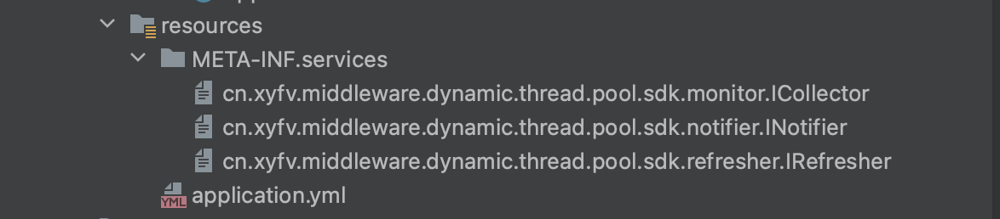
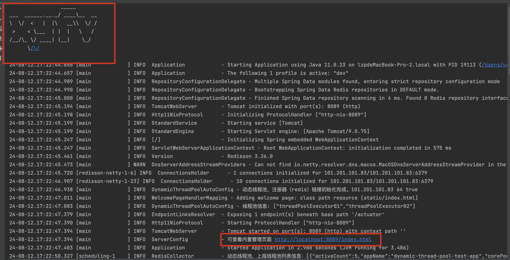

# 快速开始

本项目中的 web 模块提供一个 web 平台，并采用 redis 作为监控中心、配置中心，这里将会教大家如何使用 web 模块 + 企业微信告警快速搭建一个具备监控、告警和动态更新功能的动态线程池。

## 使用步骤

1. 引入 maven 依赖

   ```java
   <dependency>
       <groupId>io.github.cnzhangxy51</groupId>
       <artifactId>dynamic-thread-pool-web</artifactId>
       <version>1.0.0</version>
   </dependency>
   ```

2. 在 `resource` 目录下新建文件夹 `META-INF/services`，在`resource/META-INF/services`下新建以下三个文件

   |                            文件名                            |                           文件内容                           |
   | :----------------------------------------------------------: | :----------------------------------------------------------: |
   | cn.xyfv.middleware.dynamic.thread.pool.sdk.monitor.ICollector | cn.xyfv.middleware.dynamic.thread.pool.sdk.monitor.impl.RedisCollector |
   | cn.xyfv.middleware.dynamic.thread.pool.sdk.notifier.INotifier | cn.xyfv.middleware.dynamic.thread.pool.sdk.notifier.webhook.impl.WechatNotifier |
   | cn.xyfv.middleware.dynamic.thread.pool.sdk.refresher.IRefresher | cn.xyfv.middleware.dynamic.thread.pool.sdk.refresher.impl.RedisRefresher |

   

3. 在 `resource` 目录下新建配置文件`application.yml`

   ```yml
   server:
     port: 8089
   
   # 动态线程池管理配置
   dynamic:
     thread:
       pool:
         # web 平台必须要开启redis，钉钉
         web:
           # 状态；true = 开启、false 关闭
           enabled: true
         config:
           # 监控相关
           monitor:
             # 状态；true = 开启、false 关闭
             enabled: true
             channel:
               platform: redis
               cron: "*/10 * * * * ?"
           # 告警相关
           notifier:
             # 状态；true = 开启、false 关闭
             enabled: true
             # 告警平台相关
             channel:
               platform: wechat
               key: ${WECHAT_KEY}
               cron: "*/30 * * * * ?"
               messages:
                 user:
                 extend: none
   
           # 动态更新相关
           refresher:
             enabled: true
             channel:
               platform: redis
           # redis 相关，不需要不用配
           redis:
             enabled: true
             host: ${REDIS_IP}
             port: ${REDIS_PORT}
             password: ${REDIS_PASSWORD}
   
   ```

   ⚠️注：需要自己补充的地方有

   - webhook 的 key，`${WECHAT_KEY}`，用于企业微信告警，获取方式参考企业微信机器人开发文档
   - redis 的 ip 地址`${REDIS_IP}`、端口 port`${REDIS_PORT}`， 密码 password`${REDIS_PASSWORD}`
   - cron 为频率，可修改

3. 在 Springboot 启动类上加上注解 `@EnableScheduling`

4. 启动成功，会看见控制台输出 `xyfv`的 banner，以及管理页面的 URL

   

5. 点击URL，即可查看管理端：点击按钮开启自动刷新以及修改线程池参数

   
